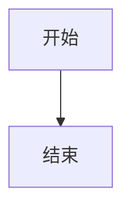
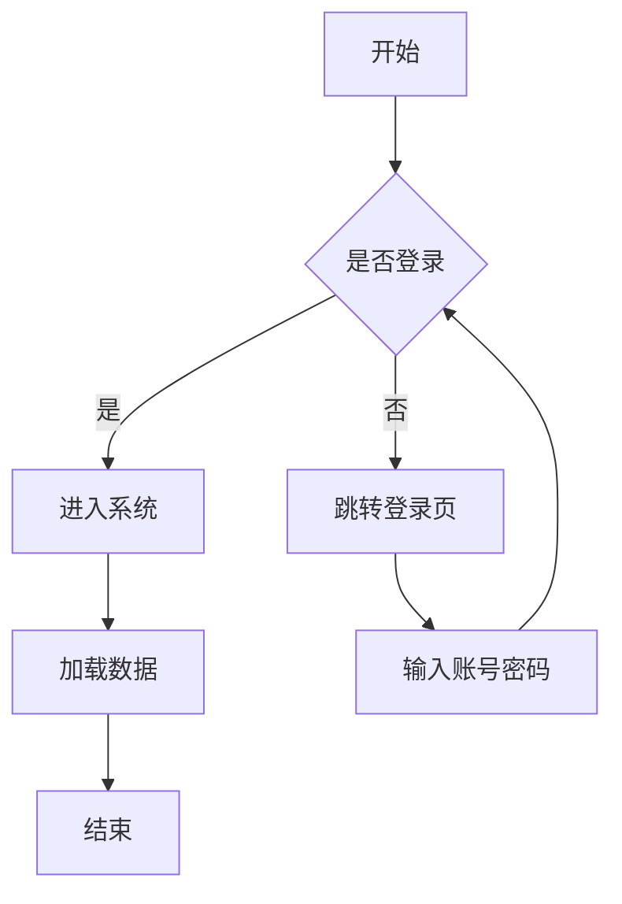
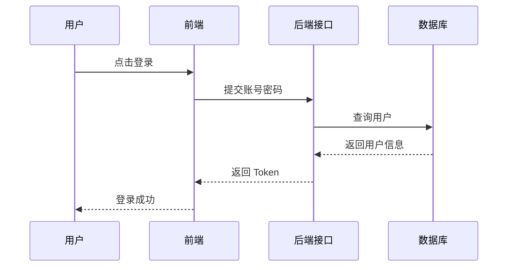
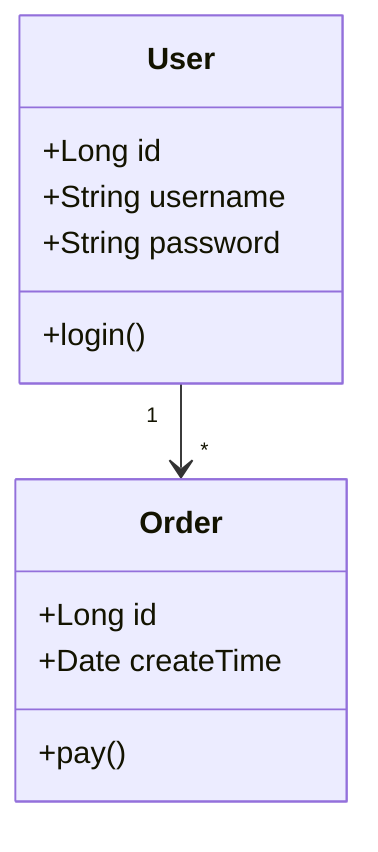
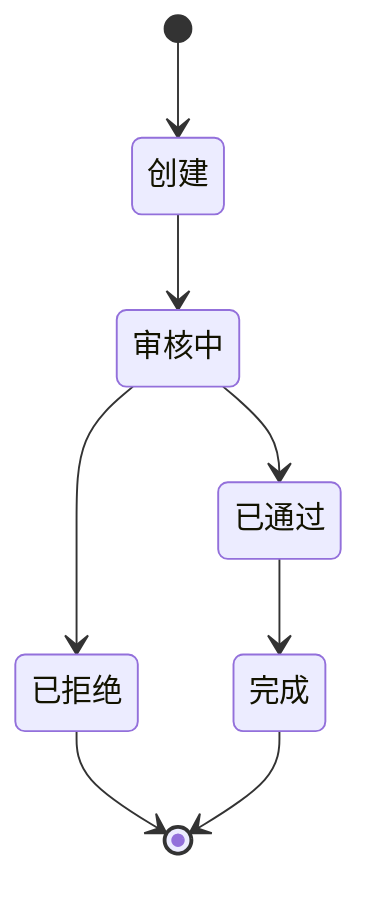
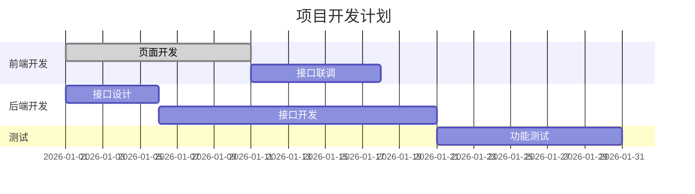
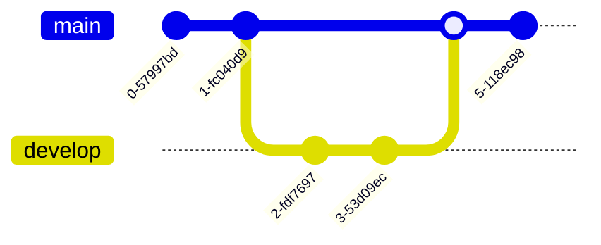
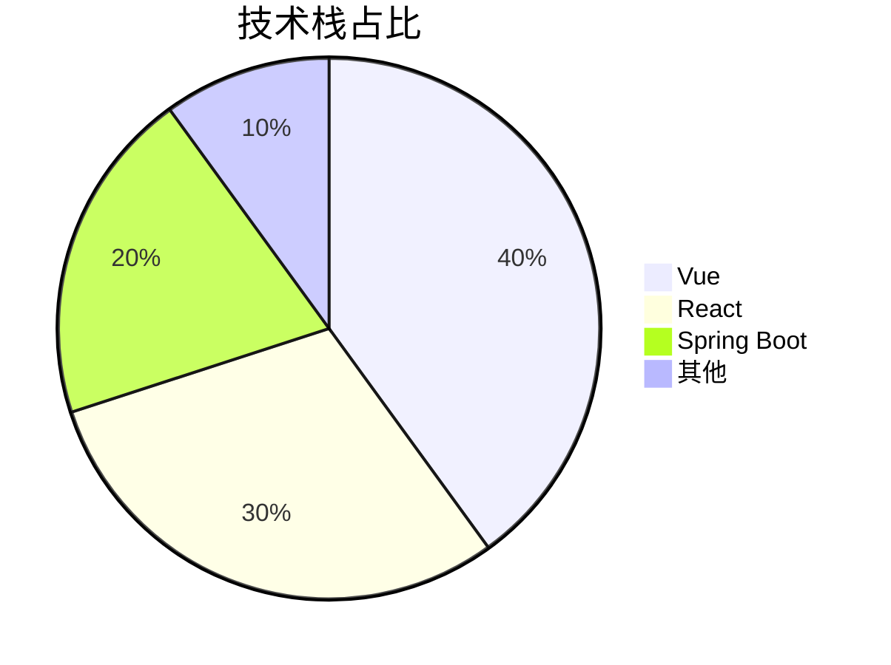

# Mermaid 图表入门

Caelum 支持在 Markdown 中用 `mermaid` 代码块绘制流程图、时序图、类图等。预览区即时渲染，并可单独或批量导出为 SVG / PNG。

> 设置 → 编辑器 →「Mermaid 主题」可切换图表配色（跟随外观 / default / dark 等）。

---

## 1. 基本写法

在 Markdown 中加入 fenced 代码块，语言标记为 `mermaid`：

````md

````

保存或切换到预览即可看到图表。图表右上角可单独导出；文档含多张图时，预览顶栏可批量导出。

---

## 2. 流程图 Flowchart



常用形状：

- `A[矩形]` 处理步骤
- `B{菱形}` 判断
- `C((圆角))` / `D[(数据库)]` 等

方向：`TD`（上→下）、`LR`（左→右）、`BT`、`RL`。

---

## 3. 时序图 Sequence Diagram



`->>` 实线请求，`-->>` 虚线返回。

---

## 4. 类图 Class Diagram



---

## 5. 状态图 State Diagram



---

## 6. 甘特图 Gantt



---

## 7. Git 分支图



---

## 8. 饼图



---

## 9. 导出建议

| 场景 | 建议 |
| --- | --- |
| 插入文档 / 再编辑 | 导出 **SVG** |
| 发聊天 / 贴幻灯片 | 导出 **PNG**（可设透明底、2x/3x 清晰度） |
| 多张图一次导出 | 预览顶栏「导出图表」→ 勾选需要的图 |

若某张图预览失败，多半是语法问题（例如 flowchart 连线被拆成多行）。把源码对照上面示例微调即可。
